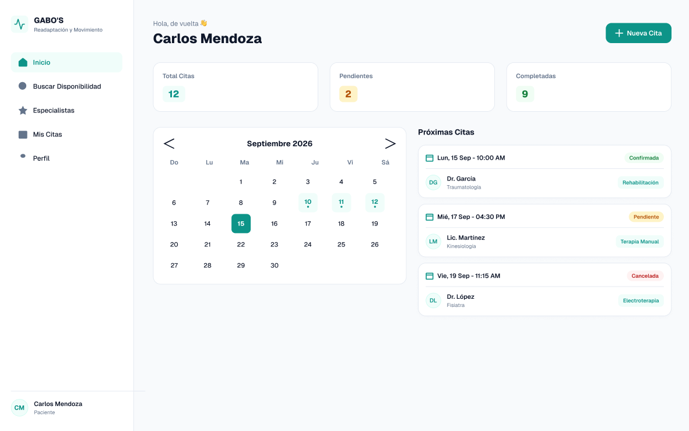
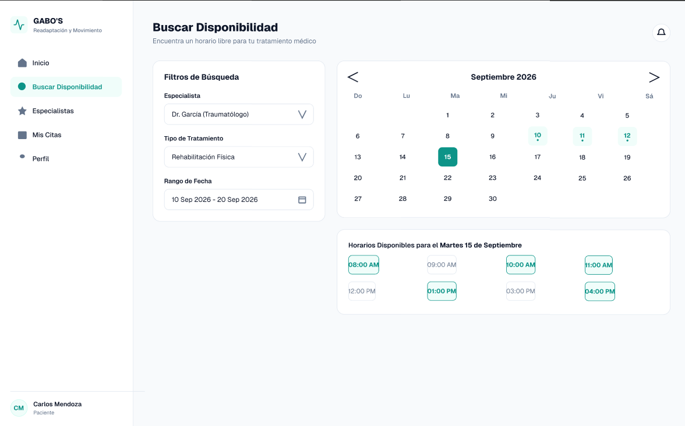
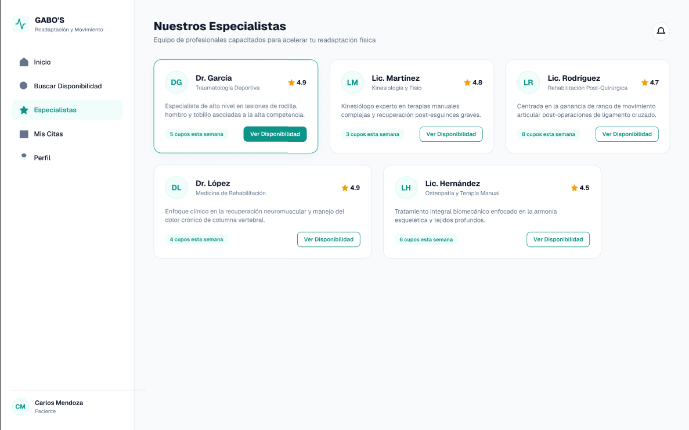
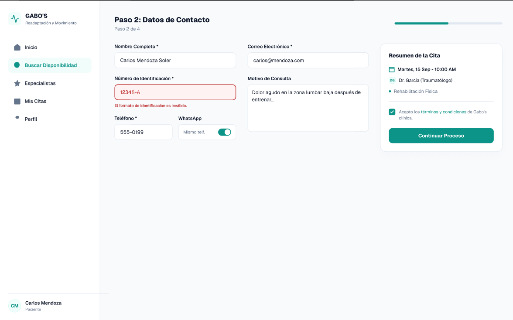
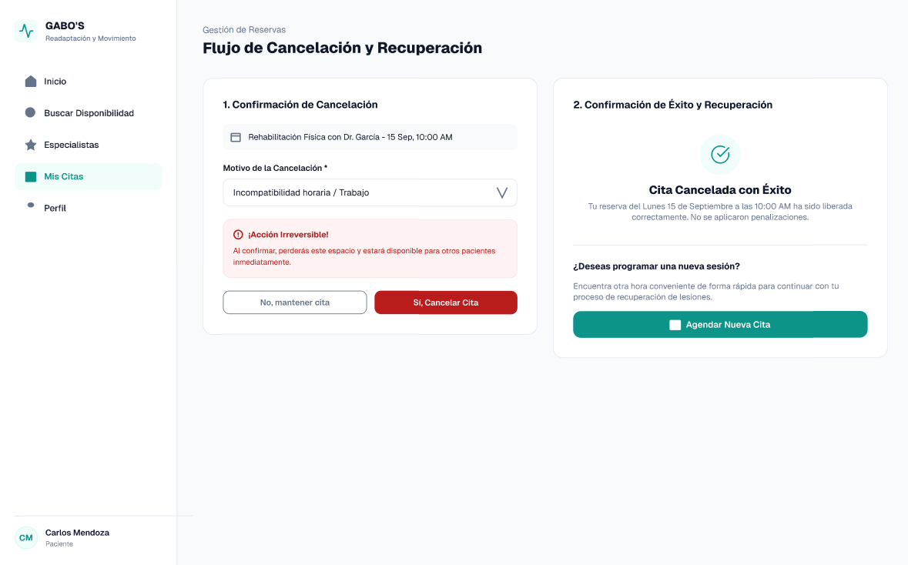
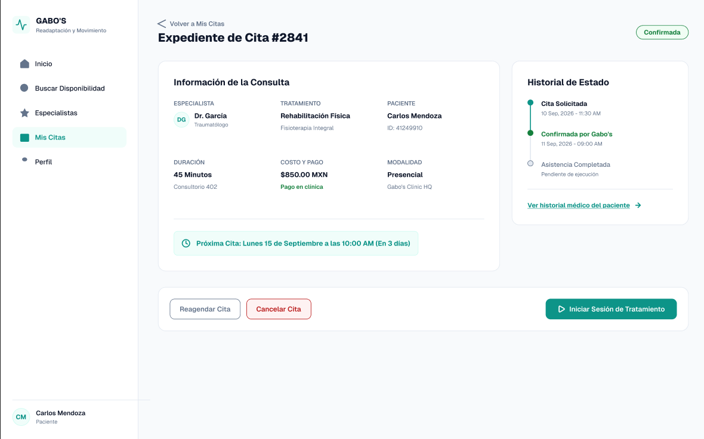

# Actividad 6: Especificación del Prototipo Navegable y Arquitectura de Interacción

## 1. Información General del Prototipo
* **Herramienta:** Figma / Web Interactive Prototype
* **Fidelidad:** Alta (High-Fidelity)
* **Enlace de Acceso:** `https://www.figma.com/design/e5eBbcsee8QaGX1c4mOiXh/Untitled?t=ZJRGDeKQND5tZx8U-1`

---

## 2. Arquitectura de Pantallas e Interacciones Clave

### 2.1 Pantalla 1: Dashboard Principal y Buscador de Disponibilidad (Semáforo de Carga)
* **Descripción:** Interfaz de entrada para el usuario/agente donde visualiza el resumen de citas del día y la disponibilidad de especialidades en tiempo real.
* **Componentes HCI:**
  * **Filtros rápidos:** Especialidad, fecha y rango horario.
  * **Indicador visual de disponibilidad (Semáforo):**
    * 🟢 **Verde:** Disponibilidad alta (> 5 cupos).
    * 🟡 **Amarillo:** Disponibilidad media (1 - 4 cupos).
    * 🔴 **Rojo:** Sin disponibilidad o cupos agotados.
* **Reducción de Carga Cognitiva:** Permite identificar la disponibilidad sin necesidad de realizar consultas profundas en el sistema.

---

### 2.2 Pantalla 2: Selección de Especialista y Horario
* **Descripción:** Módulo de selección gráfica de horarios y profesionales de la salud.
* **Componentes HCI:**
  * Tarjetas informativas del especialista con fotografía, nombre, especialidad y calificación.
  * Grilla de bloques horarios clicables organizados cronológicamente.
  * Leyenda clara de estados (Disponible, Seleccionado, Ocupado).

---

### 2.3 Pantalla 3: Formulario Por Pasos (Stepper Wizard)
* **Descripción:** Proceso de captura de datos del paciente dividido en 3 fases secuenciales para evitar el agotamiento cognitivo.
* **Estructura del Stepper:**
  1. **Paso 1: Datos del Paciente:** Identificación (Cédula/RUC), nombres completos, contacto y correo.
  2. **Paso 2: Confirmación de Cita:** Resumen de fecha, hora, médico y centro de atención.
  3. **Paso 3: Emisión de Comprobante:** Generación automática del ticket y envío de notificación.
* **Principios HCI Aplicados:**
  * Prevención de errores con validación de campos en tiempo real (regex para cédula y teléfono).
  * Botones de navegación explícitos (*"Anterior"* / *"Siguiente"*).

---

### 2.4 Pantalla 4: Expediente y Confirmación Automática
* **Descripción:** Vista final que resume la reserva realizada y ofrece opciones inmediatas de descarga o reenvío.
* **Acciones Rápidas:**
  * Descarga en PDF del comprobante.
  * Enlace para envío automático por WhatsApp / Correo Electrónico.
  * Botón para *"Agendar Nueva Cita"*.

---

### 2.5 Pantalla 5: Flujo de Cancelación y Reagendamiento
* **Descripción:** Flujo simplificado para la modificación o anulación de citas programadas.
* **Principios HCI Aplicados:**
  * **Diálogo de confirmación explícito:** Previene cancelaciones accidentales mediante una ventana modal de advertencia.
  * **Flexibilidad y control del usuario:** Opción de reagendar directamente en el mismo paso sin perder los datos previos del paciente.

---

## 3. Matriz de Mapeo de Pantallas y Principios de Diseño

| Pantalla | Principio HCI / Heurística Aplicada | Beneficio para el Usuario |
| :--- | :--- | :--- |
| **Buscador con Semáforo** | Visibilidad del estado del sistema (Nielsen #1) | Permite tomar decisiones de agendamiento instantáneas. |
| **Stepper de Formulario** | Modularidad y prevención de memoria de trabajo | Reduce la sobrecarga de datos en pantalla. |
| **Confirmación y Ticket** | Consistencia y estándares (Nielsen #4) | Genera confianza al proporcionar un comprobante claro. |
